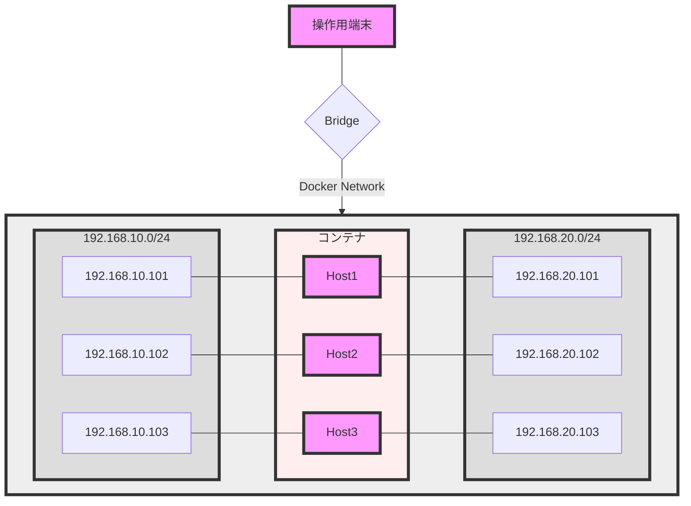

# privatetool
個人専用のツール置き場


```stl
solid STLB ATF 2.0.0.9000 COLOR=                                                  
 facet normal 0 -1 0
  outer loop
   vertex 0 0 -23.670000076293945
   vertex 20.498821258544922 0 11.835000038146973
   vertex -20.498821258544922 0 11.835000038146973
  endloop
 endfacet
 facet normal 0.816511631011963 0.333284080028534 -0.471413224935532
  outer loop
   vertex 20.498821258544922 0 11.835000038146973
   vertex 0 0 -23.670000076293945
   vertex 0 33.479999542236328 0
  endloop
 endfacet
 facet normal -0.816511631011963 0.333284080028534 -0.471413224935532
  outer loop
   vertex 0 0 -23.670000076293945
   vertex -20.498821258544922 0 11.835000038146973
   vertex 0 33.479999542236328 0
  endloop
 endfacet
 facet normal -0 0.333284080028534 0.942826449871063
  outer loop
   vertex -20.498821258544922 0 11.835000038146973
   vertex 20.498821258544922 0 11.835000038146973
   vertex 0 33.479999542236328 0
  endloop
 endfacet
endsolid
```


```stl
solid STLB ATF 2.0.0.9000 COLOR=                                                  
 facet normal 1 0 0
  outer loop
   vertex 14.5 0 14.5
   vertex 14.5 0 -14.5
   vertex 14.5 29 14.5
  endloop
 endfacet
 facet normal 1 0 0
  outer loop
   vertex 14.5 29 14.5
   vertex 14.5 0 -14.5
   vertex 14.5 29 -14.5
  endloop
 endfacet
 facet normal 0 0 1
  outer loop
   vertex -14.5 0 14.5
   vertex 14.5 0 14.5
   vertex -14.5 29 14.5
  endloop
 endfacet
 facet normal 0 0 1
  outer loop
   vertex -14.5 29 14.5
   vertex 14.5 0 14.5
   vertex 14.5 29 14.5
  endloop
 endfacet
 facet normal -1 0 0
  outer loop
   vertex -14.5 0 -14.5
   vertex -14.5 0 14.5
   vertex -14.5 29 -14.5
  endloop
 endfacet
 facet normal -1 0 0
  outer loop
   vertex -14.5 29 -14.5
   vertex -14.5 0 14.5
   vertex -14.5 29 14.5
  endloop
 endfacet
 facet normal 0 0 -1
  outer loop
   vertex 14.5 0 -14.5
   vertex -14.5 0 -14.5
   vertex 14.5 29 -14.5
  endloop
 endfacet
 facet normal 0 0 -1
  outer loop
   vertex 14.5 29 -14.5
   vertex -14.5 0 -14.5
   vertex -14.5 29 -14.5
  endloop
 endfacet
 facet normal 0 1 0
  outer loop
   vertex -14.5 29 -14.5
   vertex -14.5 29 14.5
   vertex 14.5 29 -14.5
  endloop
 endfacet
 facet normal 0 1 0
  outer loop
   vertex 14.5 29 -14.5
   vertex -14.5 29 14.5
   vertex 14.5 29 14.5
  endloop
 endfacet
 facet normal 0 -1 0
  outer loop
   vertex -14.5 0 -14.5
   vertex 14.5 0 -14.5
   vertex -14.5 0 14.5
  endloop
 endfacet
 facet normal 0 -1 0
  outer loop
   vertex -14.5 0 14.5
   vertex 14.5 0 -14.5
   vertex 14.5 0 14.5
  endloop
 endfacet
endsolid
```


```stl
solid STLB ATF 2.0.0.9000 COLOR=                                                  
 facet normal 0 0.5734623670578 0.819231927394867
  outer loop
   vertex 17.5 0 17.5
   vertex 0 25 0
   vertex -17.5 0 17.5
  endloop
 endfacet
 facet normal 0.819231927394867 0.5734623670578 0
  outer loop
   vertex 17.5 0 17.5
   vertex 17.5 0 -17.5
   vertex 0 25 0
  endloop
 endfacet
 facet normal 0 -0.577330648899078 0.816510438919067
  outer loop
   vertex -17.5 0 17.5
   vertex 0 -24.75 0
   vertex 17.5 0 17.5
  endloop
 endfacet
 facet normal -0.819231927394867 0.5734623670578 0
  outer loop
   vertex -17.5 0 17.5
   vertex 0 25 0
   vertex -17.5 0 -17.5
  endloop
 endfacet
 facet normal 0 0.5734623670578 -0.819231927394867
  outer loop
   vertex -17.5 0 -17.5
   vertex 0 25 0
   vertex 17.5 0 -17.5
  endloop
 endfacet
 facet normal 0.816510438919067 -0.577330648899078 0
  outer loop
   vertex 17.5 0 -17.5
   vertex 17.5 0 17.5
   vertex 0 -24.75 0
  endloop
 endfacet
 facet normal -0.816510438919067 -0.577330648899078 0
  outer loop
   vertex -17.5 0 -17.5
   vertex 0 -24.75 0
   vertex -17.5 0 17.5
  endloop
 endfacet
 facet normal 0 -0.577330648899078 -0.816510438919067
  outer loop
   vertex 0 -24.75 0
   vertex -17.5 0 -17.5
   vertex 17.5 0 -17.5
  endloop
 endfacet
endsolid

```


```stl
solid STLB ATF 2.0.0.9000 COLOR=                                                  
 facet normal 0 1 0
  outer loop
   vertex 0 40.080001831054688 15.310000419616699
   vertex 14.560675621032715 40.080001831054688 4.73105001449585
   vertex -14.560675621032715 40.080001831054688 4.73105001449585
  endloop
 endfacet
 facet normal 0 1 0
  outer loop
   vertex -14.560675621032715 40.080001831054688 4.73105001449585
   vertex 14.560675621032715 40.080001831054688 4.73105001449585
   vertex -8.998991966247559 40.080001831054688 -12.386050224304199
  endloop
 endfacet
 facet normal 0 1 0
  outer loop
   vertex -8.998991966247559 40.080001831054688 -12.386050224304199
   vertex 14.560675621032715 40.080001831054688 4.73105001449585
   vertex 8.998991966247559 40.080001831054688 -12.386050224304199
  endloop
 endfacet
 facet normal 0 -1 0
  outer loop
   vertex 0 24.770000457763672 24.770000457763672
   vertex -23.557670593261719 24.770000457763672 7.654350757598877
   vertex 23.557670593261719 24.770000457763672 7.654350757598877
  endloop
 endfacet
 facet normal 0 -1 0
  outer loop
   vertex 23.557670593261719 24.770000457763672 7.654350757598877
   vertex -23.557670593261719 24.770000457763672 7.654350757598877
   vertex -14.559440612792969 24.770000457763672 -20.039350509643555
  endloop
 endfacet
 facet normal 0 -1 0
  outer loop
   vertex 23.557670593261719 24.770000457763672 7.654350757598877
   vertex -14.559440612792969 24.770000457763672 -20.039350509643555
   vertex 14.559440612792969 24.770000457763672 -20.039350509643555
  endloop
 endfacet
 facet normal -0.525754451751709 0.447134166955948 0.723638892173767
  outer loop
   vertex -23.557670593261719 24.770000457763672 7.654350757598877
   vertex 0 24.770000457763672 24.770000457763672
   vertex -14.560675621032715 40.080001831054688 4.73105001449585
  endloop
 endfacet
 facet normal -0.525754451751709 0.447134166955948 0.723638892173767
  outer loop
   vertex -14.560675621032715 40.080001831054688 4.73105001449585
   vertex 0 24.770000457763672 24.770000457763672
   vertex 0 40.080001831054688 15.310000419616699
  endloop
 endfacet
 facet normal 0.525754451751709 0.447134166955948 0.723638892173767
  outer loop
   vertex 0 24.770000457763672 24.770000457763672
   vertex 23.557670593261719 24.770000457763672 7.654350757598877
   vertex 0 40.080001831054688 15.310000419616699
  endloop
 endfacet
 facet normal 0.525754451751709 0.447134166955948 0.723638892173767
  outer loop
   vertex 0 40.080001831054688 15.310000419616699
   vertex 23.557670593261719 24.770000457763672 7.654350757598877
   vertex 14.560675621032715 40.080001831054688 4.73105001449585
  endloop
 endfacet
 facet normal 0.850688576698303 0.447134166955948 -0.276405483484268
  outer loop
   vertex 23.557670593261719 24.770000457763672 7.654350757598877
   vertex 14.559440612792969 24.770000457763672 -20.039350509643555
   vertex 14.560675621032715 40.080001831054688 4.73105001449585
  endloop
 endfacet
 facet normal 0.850688576698303 0.447134166955948 -0.276405483484268
  outer loop
   vertex 14.560675621032715 40.080001831054688 4.73105001449585
   vertex 14.559440612792969 24.770000457763672 -20.039350509643555
   vertex 8.998991966247559 40.080001831054688 -12.386050224304199
  endloop
 endfacet
 facet normal 0 0.447134166955948 -0.894466876983643
  outer loop
   vertex 14.559440612792969 24.770000457763672 -20.039350509643555
   vertex -14.559440612792969 24.770000457763672 -20.039350509643555
   vertex 8.998991966247559 40.080001831054688 -12.386050224304199
  endloop
 endfacet
 facet normal 0 0.447134166955948 -0.894466876983643
  outer loop
   vertex 8.998991966247559 40.080001831054688 -12.386050224304199
   vertex -14.559440612792969 24.770000457763672 -20.039350509643555
   vertex -8.998991966247559 40.080001831054688 -12.386050224304199
  endloop
 endfacet
 facet normal -0.850688576698303 0.447134166955948 -0.276405483484268
  outer loop
   vertex -14.559440612792969 24.770000457763672 -20.039350509643555
   vertex -23.557670593261719 24.770000457763672 7.654350757598877
   vertex -8.998991966247559 40.080001831054688 -12.386050224304199
  endloop
 endfacet
 facet normal -0.850688576698303 0.447134166955948 -0.276405483484268
  outer loop
   vertex -8.998991966247559 40.080001831054688 -12.386050224304199
   vertex -23.557670593261719 24.770000457763672 7.654350757598877
   vertex -14.560675621032715 40.080001831054688 4.73105001449585
  endloop
 endfacet
 facet normal 0 -1 0
  outer loop
   vertex 0 0 -15.310000419616699
   vertex 14.560675621032715 0 -4.73105001449585
   vertex -14.560675621032715 0 -4.73105001449585
  endloop
 endfacet
 facet normal 0 -1 0
  outer loop
   vertex -14.560675621032715 0 -4.73105001449585
   vertex 14.560675621032715 0 -4.73105001449585
   vertex -8.998991966247559 0 12.386050224304199
  endloop
 endfacet
 facet normal 0 -1 0
  outer loop
   vertex -8.998991966247559 0 12.386050224304199
   vertex 14.560675621032715 0 -4.73105001449585
   vertex 8.998991966247559 0 12.386050224304199
  endloop
 endfacet
 facet normal 0 1 0
  outer loop
   vertex 0 15.310000419616699 -24.770000457763672
   vertex -23.557670593261719 15.310000419616699 -7.654350757598877
   vertex 23.557670593261719 15.310000419616699 -7.654350757598877
  endloop
 endfacet
 facet normal 0 1 0
  outer loop
   vertex 23.557670593261719 15.310000419616699 -7.654350757598877
   vertex -23.557670593261719 15.310000419616699 -7.654350757598877
   vertex -14.559440612792969 15.310000419616699 20.039350509643555
  endloop
 endfacet
 facet normal 0 1 0
  outer loop
   vertex 23.557670593261719 15.310000419616699 -7.654350757598877
   vertex -14.559440612792969 15.310000419616699 20.039350509643555
   vertex 14.559440612792969 15.310000419616699 20.039350509643555
  endloop
 endfacet
 facet normal 0.525754451751709 -0.447134166955948 -0.723638892173767
  outer loop
   vertex 0 15.310000419616699 -24.770000457763672
   vertex 23.557670593261719 15.310000419616699 -7.654350757598877
   vertex 0 0 -15.310000419616699
  endloop
 endfacet
 facet normal 0.525754451751709 -0.447134166955948 -0.723638892173767
  outer loop
   vertex 0 0 -15.310000419616699
   vertex 23.557670593261719 15.310000419616699 -7.654350757598877
   vertex 14.560675621032715 0 -4.73105001449585
  endloop
 endfacet
 facet normal -0.525754451751709 -0.447134166955948 -0.723638892173767
  outer loop
   vertex -23.557670593261719 15.310000419616699 -7.654350757598877
   vertex 0 15.310000419616699 -24.770000457763672
   vertex -14.560675621032715 0 -4.73105001449585
  endloop
 endfacet
 facet normal -0.525754451751709 -0.447134166955948 -0.723638892173767
  outer loop
   vertex -14.560675621032715 0 -4.73105001449585
   vertex 0 15.310000419616699 -24.770000457763672
   vertex 0 0 -15.310000419616699
  endloop
 endfacet
 facet normal -0.850688576698303 -0.447134166955948 0.276405483484268
  outer loop
   vertex -14.559440612792969 15.310000419616699 20.039350509643555
   vertex -23.557670593261719 15.310000419616699 -7.654350757598877
   vertex -8.998991966247559 0 12.386050224304199
  endloop
 endfacet
 facet normal -0.850688576698303 -0.447134166955948 0.276405483484268
  outer loop
   vertex -8.998991966247559 0 12.386050224304199
   vertex -23.557670593261719 15.310000419616699 -7.654350757598877
   vertex -14.560675621032715 0 -4.73105001449585
  endloop
 endfacet
 facet normal 0 -0.447134166955948 0.894466876983643
  outer loop
   vertex 14.559440612792969 15.310000419616699 20.039350509643555
   vertex -14.559440612792969 15.310000419616699 20.039350509643555
   vertex 8.998991966247559 0 12.386050224304199
  endloop
 endfacet
 facet normal -0 -0.447134166955948 0.894466876983643
  outer loop
   vertex 8.998991966247559 0 12.386050224304199
   vertex -14.559440612792969 15.310000419616699 20.039350509643555
   vertex -8.998991966247559 0 12.386050224304199
  endloop
 endfacet
 facet normal 0.850688576698303 -0.447134166955948 0.276405483484268
  outer loop
   vertex 23.557670593261719 15.310000419616699 -7.654350757598877
   vertex 14.559440612792969 15.310000419616699 20.039350509643555
   vertex 14.560675621032715 0 -4.73105001449585
  endloop
 endfacet
 facet normal 0.850688576698303 -0.447134166955948 0.276405483484268
  outer loop
   vertex 14.560675621032715 0 -4.73105001449585
   vertex 14.559440612792969 15.310000419616699 20.039350509643555
   vertex 8.998991966247559 0 12.386050224304199
  endloop
 endfacet
 facet normal -0 1 -0
  outer loop
   vertex -14.559440612792969 24.770000457763672 -20.039350509643555
   vertex -23.557670593261719 24.770000457763672 7.654350757598877
   vertex 14.559440612792969 24.770000457763672 -20.039350509643555
  endloop
 endfacet
 facet normal -0 1 -0
  outer loop
   vertex 14.559440612792969 24.770000457763672 -20.039350509643555
   vertex -23.557670593261719 24.770000457763672 7.654350757598877
   vertex -0.000000000000004 24.770000457763672 24.770000457763672
  endloop
 endfacet
 facet normal 0 1 0
  outer loop
   vertex 14.559440612792969 24.770000457763672 -20.039350509643555
   vertex -0.000000000000004 24.770000457763672 24.770000457763672
   vertex 23.557670593261719 24.770000457763672 7.654350757598877
  endloop
 endfacet
 facet normal 0.850621223449707 -0.447290569543839 0.276359766721725
  outer loop
   vertex 14.559440612792969 15.310000419616699 20.039350509643555
   vertex 23.557170867919922 15.31020450592041 -7.654868125915527
   vertex 23.557670593261719 24.770000457763672 7.654350757598877
  endloop
 endfacet
 facet normal 0.85063511133194 0.447246581315994 -0.276388108730316
  outer loop
   vertex 23.557670593261719 24.770000457763672 7.654350757598877
   vertex 23.557170867919922 15.31020450592041 -7.654868125915527
   vertex 14.559440612792969 24.770000457763672 -20.039350509643555
  endloop
 endfacet
 facet normal 0.525716364383698 -0.447261840105057 -0.723587691783905
  outer loop
   vertex 23.557170867919922 15.31020450592041 -7.654868125915527
   vertex 0 15.310000419616699 -24.770000457763672
   vertex 14.559440612792969 24.770000457763672 -20.039350509643555
  endloop
 endfacet
 facet normal -0 0.447262674570084 -0.894402623176575
  outer loop
   vertex 14.559440612792969 24.770000457763672 -20.039350509643555
   vertex 0 15.310000419616699 -24.770000457763672
   vertex -14.559440612792969 24.770000457763672 -20.039350509643555
  endloop
 endfacet
 facet normal -0.525716662406921 -0.447262674570084 -0.723586916923523
  outer loop
   vertex 0 15.310000419616699 -24.770000457763672
   vertex -23.557670593261719 15.310000419616699 -7.654350757598877
   vertex -14.559440612792969 24.770000457763672 -20.039350509643555
  endloop
 endfacet
 facet normal 0.525716662406921 0.447262674570084 0.723586916923523
  outer loop
   vertex 23.557670593261719 24.770000457763672 7.654350757598877
   vertex -0.000000000000004 24.770000457763672 24.770000457763672
   vertex 14.559440612792969 15.310000419616699 20.039350509643555
  endloop
 endfacet
 facet normal -0 -0.447262674570084 0.894402623176575
  outer loop
   vertex -14.559440612792969 15.310000419616699 20.039350509643555
   vertex 14.559440612792969 15.310000419616699 20.039350509643555
   vertex -0.000000000000004 24.770000457763672 24.770000457763672
  endloop
 endfacet
 facet normal -0.850627481937408 0.447262674570084 -0.276385605335236
  outer loop
   vertex -23.557670593261719 15.310000419616699 -7.654350757598877
   vertex -23.557670593261719 24.770000457763672 7.654350757598877
   vertex -14.559440612792969 24.770000457763672 -20.039350509643555
  endloop
 endfacet
 facet normal -0.850627481937408 -0.447262674570084 0.276385605335236
  outer loop
   vertex -23.557670593261719 24.770000457763672 7.654350757598877
   vertex -23.557670593261719 15.310000419616699 -7.654350757598877
   vertex -14.559440612792969 15.310000419616699 20.039350509643555
  endloop
 endfacet
 facet normal -0.525716662406921 0.447262674570084 0.723586916923523
  outer loop
   vertex -14.559440612792969 15.310000419616699 20.039350509643555
   vertex -0.000000000000004 24.770000457763672 24.770000457763672
   vertex -23.557670593261719 24.770000457763672 7.654350757598877
  endloop
 endfacet
 facet normal 0.000004343776254 -1 0.000005978695299
  outer loop
   vertex 0 15.310000419616699 -24.770000457763672
   vertex 23.557170867919922 15.31020450592041 -7.654868125915527
   vertex -23.557670593261719 15.310000419616699 -7.654350757598877
  endloop
 endfacet
 facet normal 0.000004343695309 -1 -0.000001411352059
  outer loop
   vertex -23.557670593261719 15.310000419616699 -7.654350757598877
   vertex 23.557170867919922 15.31020450592041 -7.654868125915527
   vertex -14.559440612792969 15.310000419616699 20.039350509643555
  endloop
 endfacet
 facet normal -0 -1 -0.000007389745406
  outer loop
   vertex -14.559440612792969 15.310000419616699 20.039350509643555
   vertex 23.557170867919922 15.31020450592041 -7.654868125915527
   vertex 14.559440612792969 15.310000419616699 20.039350509643555
  endloop
 endfacet
endsolid

```


```stl
solid STLB ATF 2.0.0.9000 COLOR=                                                  
 facet normal 0 0.794673979282379 -0.607036411762238
  outer loop
   vertex 13.001810073852539 22.100000381469727 -17.895456314086914
   vertex -13.001810073852539 22.100000381469727 -17.895456314086914
   vertex 0 35.770000457763672 0
  endloop
 endfacet
 facet normal -0.934142589569092 0.187756255269051 -0.303521335124969
  outer loop
   vertex -21.037370681762695 22.100000381469727 6.835455894470215
   vertex -13.001810073852539 22.100000381469727 -17.895456314086914
   vertex -21.037370681762695 0 -6.835455894470215
  endloop
 endfacet
 facet normal -0.577325940132141 0.794673979282379 -0.187584578990936
  outer loop
   vertex -21.037370681762695 22.100000381469727 6.835455894470215
   vertex 0 35.770000457763672 0
   vertex -13.001810073852539 22.100000381469727 -17.895456314086914
  endloop
 endfacet
 facet normal 0 0.187756255269051 -0.982215642929077
  outer loop
   vertex 13.001810073852539 22.100000381469727 -17.895456314086914
   vertex 0 0 -22.120000839233398
   vertex -13.001810073852539 22.100000381469727 -17.895456314086914
  endloop
 endfacet
 facet normal 0.577325940132141 0.794673979282379 -0.187584578990936
  outer loop
   vertex 13.001810073852539 22.100000381469727 -17.895456314086914
   vertex 0 35.770000457763672 0
   vertex 21.037370681762695 22.100000381469727 6.835455894470215
  endloop
 endfacet
 facet normal -0.356807053089142 0.794673979282379 0.491102784872055
  outer loop
   vertex 0 22.100000381469727 22.120000839233398
   vertex 0 35.770000457763672 0
   vertex -21.037370681762695 22.100000381469727 6.835455894470215
  endloop
 endfacet
 facet normal -0.577331900596619 -0.187756255269051 -0.794629156589508
  outer loop
   vertex -21.037370681762695 0 -6.835455894470215
   vertex -13.001810073852539 22.100000381469727 -17.895456314086914
   vertex 0 0 -22.120000839233398
  endloop
 endfacet
 facet normal 0.356807053089142 0.794673979282379 0.491102784872055
  outer loop
   vertex 21.037370681762695 22.100000381469727 6.835455894470215
   vertex 0 35.770000457763672 0
   vertex 0 22.100000381469727 22.120000839233398
  endloop
 endfacet
 facet normal 0.577331900596619 -0.187756255269051 -0.794629156589508
  outer loop
   vertex 0 0 -22.120000839233398
   vertex 13.001810073852539 22.100000381469727 -17.895456314086914
   vertex 21.037370681762695 0 -6.835455894470215
  endloop
 endfacet
 facet normal -0.577325940132141 -0.794673979282379 0.187584578990936
  outer loop
   vertex -13.001810073852539 0 17.895456314086914
   vertex -21.037370681762695 0 -6.835455894470215
   vertex 0 -13.670000076293945 0
  endloop
 endfacet
 facet normal -0.356807053089142 -0.794673979282379 -0.491102784872055
  outer loop
   vertex 0 -13.670000076293945 0
   vertex -21.037370681762695 0 -6.835455894470215
   vertex 0 0 -22.120000839233398
  endloop
 endfacet
 facet normal -0.934142589569092 -0.187756255269051 0.303521335124969
  outer loop
   vertex -13.001810073852539 0 17.895456314086914
   vertex -21.037370681762695 22.100000381469727 6.835455894470215
   vertex -21.037370681762695 0 -6.835455894470215
  endloop
 endfacet
 facet normal 0.356807053089142 -0.794673979282379 -0.491102784872055
  outer loop
   vertex 0 0 -22.120000839233398
   vertex 21.037370681762695 0 -6.835455894470215
   vertex 0 -13.670000076293945 0
  endloop
 endfacet
 facet normal -0.577331900596619 0.187756255269051 0.794629156589508
  outer loop
   vertex -13.001810073852539 0 17.895456314086914
   vertex 0 22.100000381469727 22.120000839233398
   vertex -21.037370681762695 22.100000381469727 6.835455894470215
  endloop
 endfacet
 facet normal 0.577331900596619 0.187756255269051 0.794629156589508
  outer loop
   vertex 21.037370681762695 22.100000381469727 6.835455894470215
   vertex 0 22.100000381469727 22.120000839233398
   vertex 13.001810073852539 0 17.895456314086914
  endloop
 endfacet
 facet normal -0 -0.187756255269051 0.982215642929077
  outer loop
   vertex -13.001810073852539 0 17.895456314086914
   vertex 13.001810073852539 0 17.895456314086914
   vertex 0 22.100000381469727 22.120000839233398
  endloop
 endfacet
 facet normal 0.934142589569092 0.187756255269051 -0.303521335124969
  outer loop
   vertex 21.037370681762695 0 -6.835455894470215
   vertex 13.001810073852539 22.100000381469727 -17.895456314086914
   vertex 21.037370681762695 22.100000381469727 6.835455894470215
  endloop
 endfacet
 facet normal 0.934142589569092 -0.187756255269051 0.303521335124969
  outer loop
   vertex 21.037370681762695 22.100000381469727 6.835455894470215
   vertex 13.001810073852539 0 17.895456314086914
   vertex 21.037370681762695 0 -6.835455894470215
  endloop
 endfacet
 facet normal 0.577325940132141 -0.794673979282379 0.187584578990936
  outer loop
   vertex 21.037370681762695 0 -6.835455894470215
   vertex 13.001810073852539 0 17.895456314086914
   vertex 0 -13.670000076293945 0
  endloop
 endfacet
 facet normal -0 -0.794673979282379 0.607036411762238
  outer loop
   vertex 13.001810073852539 0 17.895456314086914
   vertex -13.001810073852539 0 17.895456314086914
   vertex 0 -13.670000076293945 0
  endloop
 endfacet
endsolid
```


# ローカル端末での環境構築  

## 動作環境のイメージ図  
※ 図に違和感がある理由は、新しいもの（Mermaid）で作図してみたことが原因。  




# 環境起動までの手順  

* git clone https://github.com/JunichiWatanuki/privatetool.git  
* リポジトリのディレクトリ（`privatetool`）に移動する  
* Docker-composeでコンテナイメージをビルドする  

```
docker-compose -f .github/actions/test3containersEnv/docker-compose.yml --env-file .github/actions/test3containersEnv/.env build
```

* ビルドが終わったらコンテナを起動する  

```
docker-compose -f .github/actions/test3containersEnv/docker-compose.yml --env-file .github/actions/test3containersEnv/.env up --abort-on-container-exit &
```

* 作業が終わったらプロセスをkillする  

```
killall docker-compose
```
